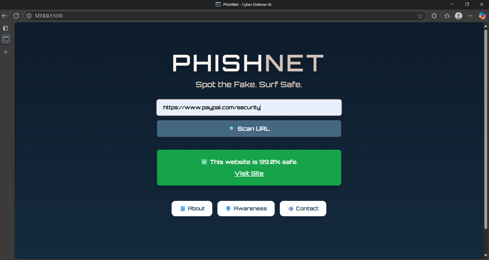

# 🐟 PhishNet – AI-Powered Phishing Detection

PhishNet is a lightweight and fast phishing detection tool that uses machine learning to detect suspicious URLs and emails. Built with Flask and TailwindCSS, it provides both a REST API and a sleek web UI.

---

### 🌐 Live Demo  
Want to test PhishNet in real time?  
▶️ https://phishnet-app.onrender.com/

## 🚀 Features

- 🔗 URL-based phishing detection using handcrafted lexical features
- 📧 Email text classification with TF-IDF + Logistic Regression
- 🌐 Flask backend with REST API endpoints
- 💻 Minimal and responsive web UI (TailwindCSS)
- 🧠 Pre-trained models included (no training required)
- ⚙️ Easily deployable on Render or any cloud platform

---

## 📸 Screenshot

 <!-- Rename or replace this file if needed -->

---

## 🧪 Tech Stack

- Python 3.10
- Flask + Gunicorn
- scikit-learn
- TailwindCSS (via CDN)
- BeautifulSoup, Pandas, NumPy
- Render (for deployment)

---

## 📁 Project Structure

```
PhishNet/
├── backend/
│   ├── app.py              # Flask app with routes and prediction logic
│   ├── model_url.pkl       # Trained URL model
│   ├── model_email.pkl     # Trained Email model (optional)
│   └── utils.py            # Feature extraction helpers
├── static/
│   └── style.css           # TailwindCSS config (if any)
├── templates/
│   └── index.html          # Web UI (Tailwind + Jinja)
├── docs/
│   └── screenshot.png      # UI preview image
├── requirements.txt
└── README.md
```

---

## 📦 Setup & Run Locally

```bash
# Clone the repo
git clone https://github.com/Pari0226/PhishNet.git
cd PhishNet/backend

# Install dependencies
pip install -r requirements.txt

# Run the app
python app.py
```

Access the app at: [http://localhost:5000](http://localhost:5000)

---

## 🌍 API Endpoints

- `POST /predict-url` – JSON: `{ "url": "http://example.com" }`
- `POST /predict-email` – JSON: `{ "text": "You've won a prize!" }`

Returns predictions and probability scores.

---

## 📤 Deployment

You can deploy this on:

- [Render.com](https://render.com) (free tier)
- Any platform supporting Flask (Heroku, Railway, etc.)

Example Render setup:

```bash
# render.yaml
buildCommand: "pip install -r requirements.txt"
startCommand: "gunicorn app:app"
```

---

## 📄 License

MIT License © 2025 [Pari Singh](https://github.com/Pari0226)
